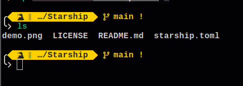
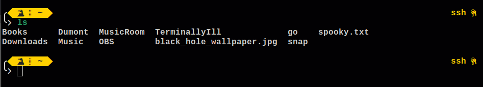

# Starship
Ancap Theme for [Starship](https://github.com/starship/starship)

## Preview


If you're in a ssh session it has an indication on the right side


### Install
Run the command below to download and install the theme.
```bash
curl -L -o install.sh https://raw.githubusercontent.com/AncapTheme/Starship/main/install.sh && chmod +x ./install.sh && ./install.sh
```
